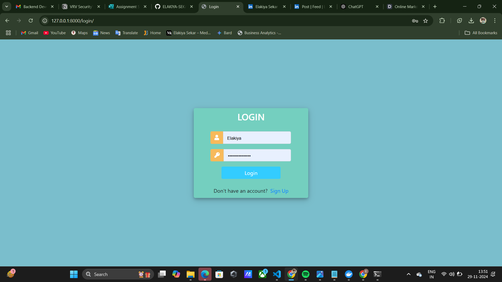
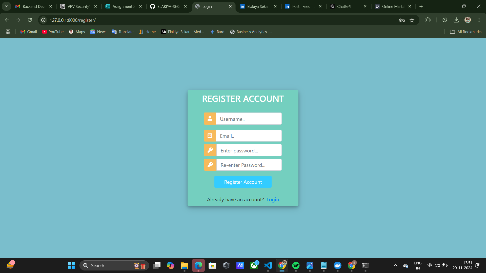
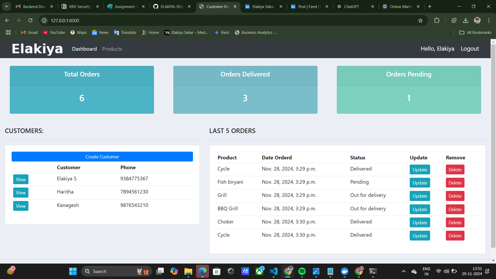
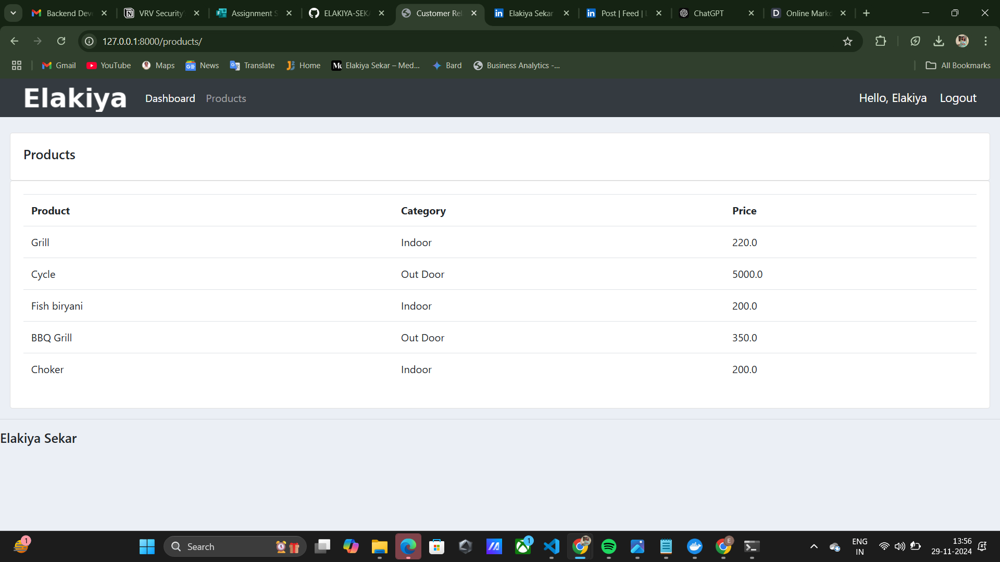
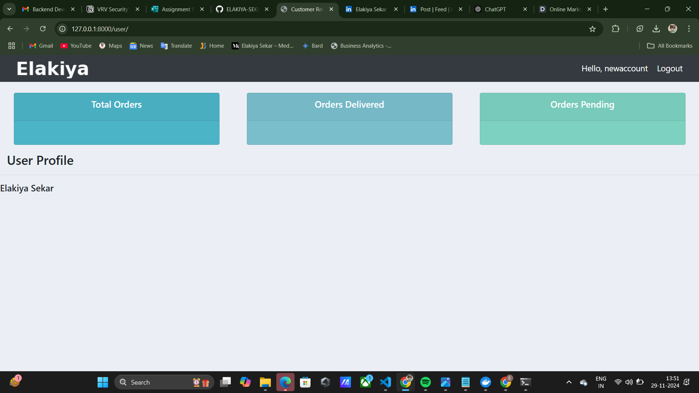
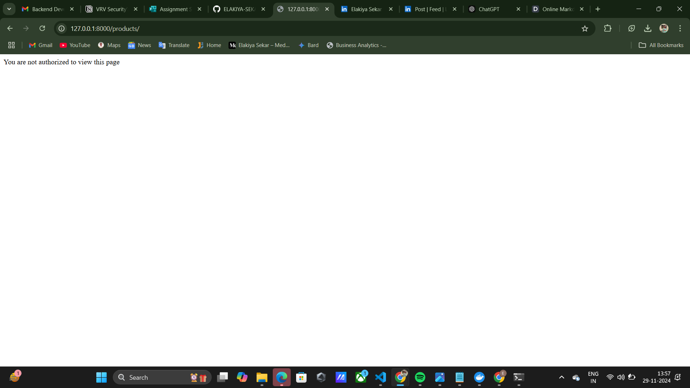

# Customer-Management-System-RBAC
Customer Management System with RBAC is a project designed to streamline the management of products and orders. In this system, customers can create and view their own orders, but they cannot access details about other customers' orders or products managed by the admin. The admin has full control over managing all products and orders, ensuring data security and privacy. Role-Based Access Control (RBAC) ensures that users only access data and features relevant to their roles. This system is ideal for maintaining an organized and secure workflow in customer and order management.

## 
## Steps of implementation

## 1. `unauthenticated_user` Decorator

### Purpose:
The `unauthenticated_user` decorator restricts access to views for authenticated users. If the user is logged in, they are redirected to the home page; otherwise, they can access the view.

### How it works:
- It checks if the user is authenticated using `request.user.is_authenticated`.
- If the user is authenticated, they are redirected to a predefined page (e.g., `home`).
- If the user is not authenticated, the view function is executed and access is granted.

### Code:
```python
def unauthenticated_user(view_func):
    def wrapper_func(request, *args, **kwargs):
        if request.user.is_authenticated:
            return redirect('home')
        else:
            return view_func(request, *args, **kwargs)
    return wrapper_func
```

---

## 2. `allowed_users` Decorator

### Purpose:
The `allowed_users` decorator ensures that only users who belong to a specified group (role) can access a view. If the user is not in the allowed group, they will see an unauthorized message.

### How it works:
- The decorator accepts a list of `allowed_roles` and checks if the user's group matches any of the roles in the list.
- If the user belongs to an allowed group, the view function is executed.
- If the user does not belong to an allowed group, an HTTP response with a "not authorized" message is returned.

### Code:
```python
def allowed_users(allowed_roles=[]):
    def decorator(view_func):
        def wrapper_func(request, *args, **kwargs):
            group = None
            if request.user.groups.exists():
                group = request.user.groups.all()[0].name

            if group in allowed_roles:
                return view_func(request, *args, **kwargs)
            else:
                return HttpResponse('You are not authorized to view this page')
        return wrapper_func
    return decorator
```

---

## 3. `admin_only` Decorator

### Purpose:
The `admin_only` decorator restricts views to only admin users. If a user is a "customer," they are redirected to their user page. If the user is an "admin," the view is executed.

### How it works:
- The decorator checks the group of the logged-in user.
- If the user is a "customer," they are redirected to a different page (e.g., `user-page`).
- If the user is an "admin," the view function is executed.
- If the user is neither an admin nor a customer, an unauthorized response is returned.

### Code:
```python
def admin_only(view_func):
    def wrapper_function(request, *args, **kwargs):
        group = None
        if request.user.groups.exists():
            group = request.user.groups.all()[0].name

        if group == 'customers':
            return redirect('user-page')

        if group == 'admin':
            return view_func(request, *args, **kwargs)

        return HttpResponse('You are not authorized to view this page')

    return wrapper_function
```

---
### This is the login page



### This is the register page



### This is the admin page





### This is the customers page





# Instructions to Run

### 1. **Create a Superuser**

A superuser is a user with administrative rights to manage the entire Django project, including creating users, managing models, and more.

#### Steps to Create a Superuser:
1. Open your terminal or command prompt and navigate to the project directory:
   ```bash
   cd /RBAC-Customer-Management-System-main/
   ```

2. Run the following command to create a superuser:
   ```bash
   python manage.py createsuperuser
   ```

3. You will be prompted to enter details for the superuser:
   - **Username:** Enter a username (e.g., `admin`).
   - **Email address:** Enter an email (e.g., `admin@example.com`).
   - **Password:** Set a password (make sure it is strong).

   Example:
   ```bash
   Username: admin
   Email address: admin@example.com
   Password: ********
   Password (again): ********
   ```

4. If all details are valid, Django will confirm the superuser creation.

---

### 2. **Create a Regular User**

Now, create a regular user who will have limited access to the application (e.g., a customer).

#### Steps to Create a Regular User:
1. In the Django Admin panel, you can create a regular user manually, or use the Django shell to create it programmatically.
   - For manual creation, you can log into the Admin page once the server is running and add users via the interface.

   **OR**

2. You can also use the following command to create a user via the Django shell:
   ```bash
   python manage.py shell
   ```

   In the shell, you can use this code to create a user:
   ```python
   from django.contrib.auth.models import User
   user = User.objects.create_user('customer1', 'customer@example.com', 'password123')
   user.save()
   ```

---

### 3. **Start the Development Server**

Run the following command to start the Django development server:

```bash
python manage.py runserver
```

This will start the server and you should see output similar to:

```bash
Starting development server at http://127.0.0.1:8000/
Quit the server with CONTROL-C.
```

---

### 4. **Access the Admin Page**

1. Open your web browser and go to the Django admin panel at:
   ```bash
   http://127.0.0.1:8000/admin/
   ```

2. Log in using the superuser credentials you created earlier (e.g., `admin`/`password123`).

---

### 5. **Create Product, Orders, and Tags in the Admin Panel**

Once logged in as the superuser, you can manage various models (e.g., product orders, tags, etc.) from the Django Admin page.

#### Steps to Create Products, Orders, and Tags:
1. **Create Product:**
   - On the admin panel, you should see the list of available models (e.g., `Products`, `Orders`, `Tags`).
   - Click on the `Products` model.
   - Click **Add Product**.
   - Fill in the required details (e.g., product name, description, price, etc.), and click **Save**.

2. **Create Orders:**
   - Click on the `Orders` model in the admin panel.
   - Click **Add Order**.
   - Fill in the details for the order (e.g., associated customer, products ordered, status, etc.).
   - Click **Save**.

3. **Create Tags:**
   - Click on the `Tags` model in the admin panel.
   - Click **Add Tag**.
   - Enter the tag name (e.g., `Electronics`, `Clothing`), and click **Save**.

---

### 6. **Access and Test the System**

Once you've created products, orders, and tags in the admin panel, you can access the product pages as both the admin user and the regular user.

- As a **superuser** (admin), you can manage and edit all data.
- As a **regular user**, you will only be able to access the customers page.


